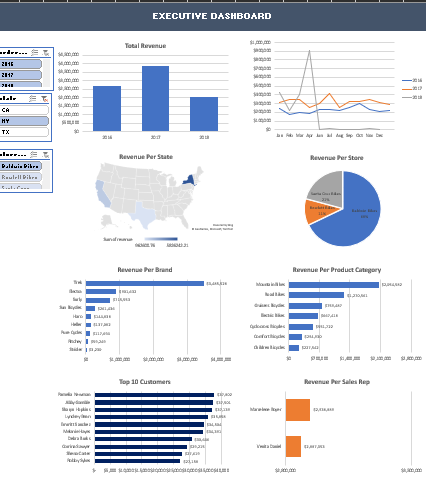
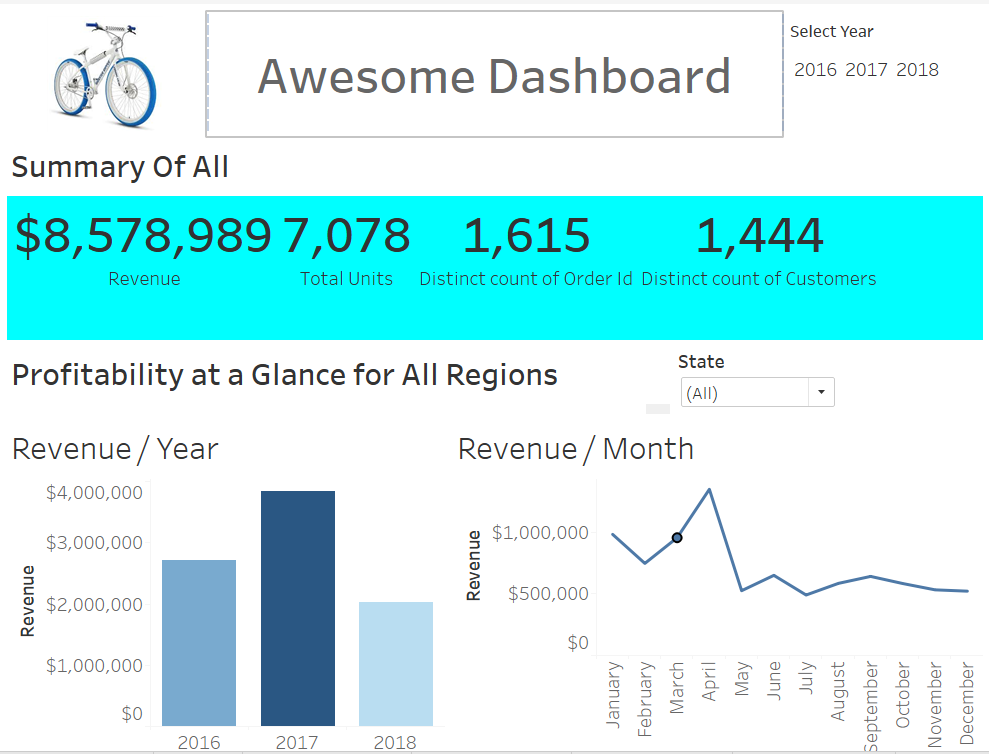
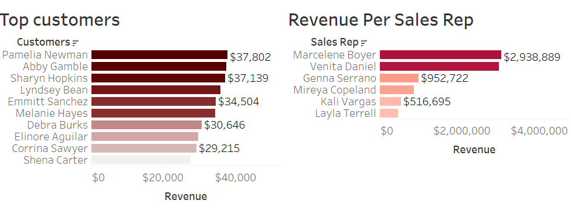

# 🚴 Data Analysis Project: SQL, Excel, and Tableau Dashboard  

## 📌 Project Overview  
Dive into a comprehensive data analysis journey where SQL meets Excel and Tableau to uncover fascinating insights from bicycle data.  

## 🔍 Key Steps  
1. **SQL Data Extraction** – Masterfully crafted SQL queries to fetch the precise dataset needed.  
2. **Excel Dashboard** – Developed a dynamic and visually appealing dashboard using Microsoft Excel.  
3. **Tableau Visualization** – Created an interactive and insightful Tableau dashboard for in-depth analysis.  

## 🛠️ Technologies Used  
- **SQL** – For powerful data retrieval and manipulation (`customizedQuery.sql`).  
- **Microsoft Excel** – For meticulous data cleaning and stunning dashboard creation (`Bicycles.xlsx`).  
- **Tableau** – For immersive and interactive data visualization (`Capwell's_firstDashboard.twb`).  

## 📊 Insights & Results  
- *[Highlight the most intriguing findings from your analysis here.]*  

## 🖼️ Dashboard Previews  
### 📊 Excel Dashboard  
  

### 📈 Tableau Dashboard  
  
  
  

<noscript></noscript><object class='tableauViz'  style='display:none;'><param name='host_url' value='https%3A%2F%2Fpublic.tableau.com%2F' /> <param name='embed_code_version' value='3' /> <param name='site_root' value='' /><param name='name' value='Capwells_firstDashboard&#47;Dashboard1' /><param name='tabs' value='no' /><param name='toolbar' value='yes' /><param name='static_image' value='https:&#47;&#47;public.tableau.com&#47;static&#47;images&#47;Ca&#47;Capwells_firstDashboard&#47;Dashboard1&#47;1.png' /> <param name='animate_transition' value='yes' /><param name='display_static_image' value='yes' /><param name='display_spinner' value='yes' /><param name='display_overlay' value='yes' /><param name='display_count' value='yes' /><param name='language' value='en-US' /><param name='filter' value='publish=yes' /></object>
                

## 🚀 How to Use  
1. Execute `customizedQuery.sql` to extract the data.  
2. Open `Bicycles.xlsx` to explore static insights.  
3. Launch `Tableau_Dashboard.twbx` in Tableau for an interactive data exploration experience.  
