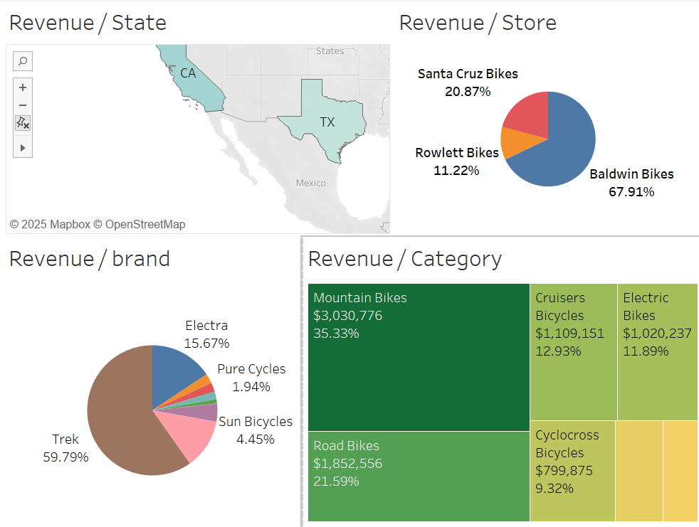

# 🚴 Data Analysis Project: SQL, Excel, and Tableau Dashboard  

## 📌 Project Overview  
Dive into a comprehensive data analysis journey where SQL meets Excel and Tableau to uncover fascinating insights from bicycle data.  

## 🔍 Key Steps  
1. **SQL Data Extraction** – Masterfully crafted SQL queries to fetch the precise dataset needed.  
2. **Excel Dashboard** – Developed a dynamic and visually appealing dashboard using Microsoft Excel.  
3. **Tableau Visualization** – Created an interactive and insightful Tableau dashboard for in-depth analysis.  

## 🛠️ Technologies Used  
- **SQL** – For powerful data retrieval and manipulation (`customizedQuery.sql`).  
- **Microsoft Excel** – For meticulous data cleaning and stunning dashboard creation (`Bicycles.xlsx`).  
- **Tableau** – For immersive and interactive data visualization (`Capwell's_firstDashboard.twb`).  

## 📊 Insights & Results  
- *[Highlight the most intriguing findings from your analysis here.]*  

## 🖼️ Dashboard Previews  
### 📊 Excel Dashboard  
  

### 📈 Tableau Dashboard  
  
  
  

<iframe src="https://public.tableau.com/views/Capwells_firstDashboard/Dashboard1?:showVizHome=no&:embed=true" width="1000" height="600"></iframe>

## 🚀 How to Use  
1. Execute `customizedQuery.sql` to extract the data.  
2. Open `Bicycles.xlsx` to explore static insights.  
3. Launch `Tableau_Dashboard.twbx` in Tableau for an interactive data exploration experience.  
